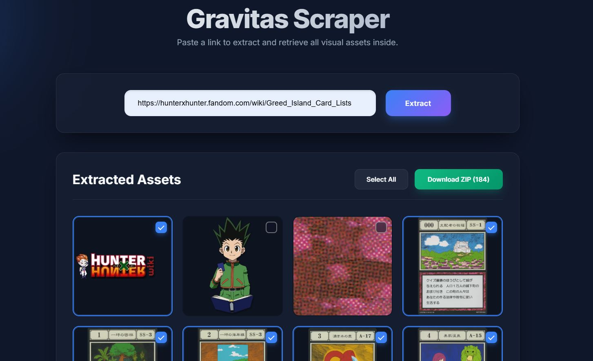

<p align="center">
  
  
  
  
</p>

# 🌀 Gravitas — Image Scraper

> A premium, local-first web application that visually scrapes, previews, and batch-downloads images from any website — including modern JavaScript-heavy SPAs and wiki pages.



---

## ✨ Features

| Feature | Description |
|---|---|
| **SPA-Compatible Scraping** | Uses Playwright (headless Chromium) to fully render JavaScript pages before extracting images — no images are missed. |
| **High-Res Extraction** | Automatically strips Fandom/Wikia downscaling parameters and Pinterest thumbnail paths to retrieve the original full-resolution asset. |
| **Metadata-Aware Naming** | Extracts contextual metadata (alt text, captions, infobox data) and uses it to generate descriptive filenames in the download. |
| **Glassmorphic UI** | A dark-mode interface with animated ambient blobs, glass panels, smooth micro-animations, and responsive layout. |
| **Visual Selection Grid** | Browse all extracted images in a dynamic grid; click to select/deselect individual assets before downloading. |
| **One-Click ZIP Export** | Selected images are packaged server-side into a single `.zip` file and streamed to your browser. |
| **Lazy-Load Handling** | Auto-scrolls the target page to trigger lazy-loaded images common on wikis and galleries. |

---

## 📸 How It Works

```
┌──────────────┐     POST /api/scrape      ┌──────────────────┐
│  Browser UI  │ ──────────────────────────▶│  Flask Backend   │
│  (HTML/JS)   │                            │                  │
│              │◀────── JSON (image list) ──│  Playwright      │
│  Select imgs │                            │  launches Chrome │
│              │     POST /api/download     │  scrolls, parses │
│  Click ZIP   │ ──────────────────────────▶│  DOM for    │
│              │◀────── ZIP stream ─────────│                  │
└──────────────┘                            └──────────────────┘
```

1. **Paste a URL** into the input field and hit **Extract**.
2. The backend launches a headless Chromium browser, navigates to the page, scrolls to trigger lazy-loading, and parses every `` tag.
3. Extracted image URLs (with metadata) are returned to the frontend and displayed in a selectable grid.
4. **Select** the images you want, then click **Download ZIP** — the server fetches each image in parallel and streams a ZIP archive back.

---

## 🚀 Quick Start

### Prerequisites

- [Python 3.8+](https://www.python.org/downloads/)
- [Git](https://git-scm.com/downloads)

### 1. Clone the Repository

```bash
git clone https://github.com/has-beep/Image-Scraper.git
cd Image-Scraper
```

### 2. Create & Activate a Virtual Environment

**Windows (PowerShell):**
```powershell
python -m venv venv
.\venv\Scripts\activate
```

**macOS / Linux:**
```bash
python3 -m venv venv
source venv/bin/activate
```

### 3. Install Dependencies

```bash
pip install -r requirements.txt
```

### 4. Install Playwright Browsers

Playwright needs to download a Chromium binary the first time:

```bash
playwright install chromium
```

### 5. Run the Application

```bash
python app.py
```

Open your browser and go to **[http://127.0.0.1:3000](http://127.0.0.1:3000)**.

---

## 📁 Project Structure

```
Image-Scraper/
├── app.py                 # Flask backend — scrape & download API endpoints
├── requirements.txt       # Pinned Python dependencies
├── test_scrape.py         # Standalone Playwright scraping test script
├── .gitignore             # Files excluded from version control
├── LICENSE                # MIT License
├── README.md              # This file
├── templates/
│   └── index.html         # Jinja2 HTML template (main page)
└── static/
    ├── style.css          # Glassmorphic dark-mode stylesheet
    └── script.js          # Frontend logic (grid, selection, download)
```

---

## 🔌 API Reference

### `POST /api/scrape`

Scrapes a target URL for all visible images.

**Request Body:**
```json
{
  "url": "https://example.com/gallery"
}
```

**Response (200):**
```json
{
  "images": [
    {
      "url": "https://example.com/image1.png",
      "info": "Card Name\nType: Magic\nRank: SS"
    }
  ]
}
```

| Field | Type | Description |
|---|---|---|
| `url` | `string` | Absolute URL of the extracted image |
| `info` | `string` | Contextual metadata scraped from surrounding HTML (alt text, captions, infobox fields). Newlines separated by `\n`. |

---

### `POST /api/download`

Fetches selected images and returns them as a ZIP archive.

**Request Body:**
```json
{
  "items": [
    { "url": "https://example.com/image1.png", "info": "Card Name" }
  ]
}
```

**Response:** Binary ZIP file stream (`application/zip`).

---

## ⚙️ Configuration

| Setting | Location | Default | Description |
|---|---|---|---|
| Port | `app.py` line 214 | `3000` | The local port the Flask dev server binds to |
| Debug mode | `app.py` line 214 | `True` | Flask debug mode (auto-reload on code changes) |
| Headless Chrome | `app.py` line 25 | `True` | Set to `False` to watch the browser scrape visually |
| Download workers | `app.py` line 189 | `5` | Max parallel threads for image downloads |
| Navigation timeout | `app.py` line 31 | `20000ms` | Max wait time for a page to load |

---

## 🛡️ Limitations & Notes

- **Local use only** — This is a development server and is not designed to be deployed to the public internet.
- **Respects robots.txt?** — No. This tool scrapes whatever URL you give it. Use responsibly and respect website terms of service.
- **CORS / Auth** — Sites behind login walls or CAPTCHAs will not return useful results.
- **Large pages** — Very image-heavy pages (500+ images) may take longer to extract and download.

---

## 🧰 Tech Stack

| Layer | Technology |
|---|---|
| **Backend** | Python · Flask |
| **Scraping Engine** | Playwright (Chromium) |
| **HTTP Requests** | Requests (parallel via ThreadPoolExecutor) |
| **Frontend** | Vanilla HTML · CSS · JavaScript |
| **Fonts** | Google Fonts (Inter) |
| **Design** | Glassmorphism · CSS animations · Responsive grid |

---

## 📝 License

This project is licensed under the [MIT License](LICENSE).

---

<p align="center">
  Built with ☕ and curiosity.
</p>
